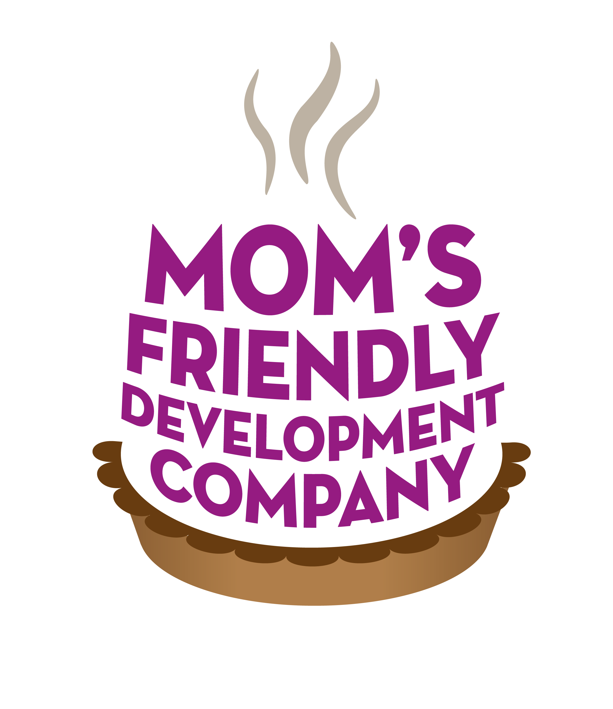

	

The Momsronomicon
=================
A concise and (not) complete list of the procedures, advice, tips and miscellany of [Mom's Friendly Development Company](http://mfdc.biz).

Table of contents
=================

1. [Development stack](devstack.md)
	1. [Node dev stack](devstack-node.md)
	2. [PHP dev stack (legacy projects)](devstack-php.md)
2. [Projects](projects.md)
	1. [Tools](tools.md)
	2. [General style](style.md)
	3. [PHP projects](style-php.md)
	4. [Node projects](style-node.md)
	5. [Angular projects](style-angular.md)
	6. [Getting started](getting-started.md)
3. [Hosting](hosting.md)
	1. [DigitalOcean / VMs](hosting-do.md)
4. [Job descriptions](jobs.md)
	1. [Interviewing](interviews.md)
	2. [Newbie guide](newbie.md)
5. [Deploying a project](deployment.md)
6. [Managing clients](clients.md)
7. [Further reading](further-reading.md)
8. [Glossary](glossary.md)
9. [Misc Guides](guides.md)
	1. [Tunneling with Linux / MacOSX](tunneling.md)
	2. [Setting up SSH keys](ssh-keys.md)
10. [TODO](TODO.md)
