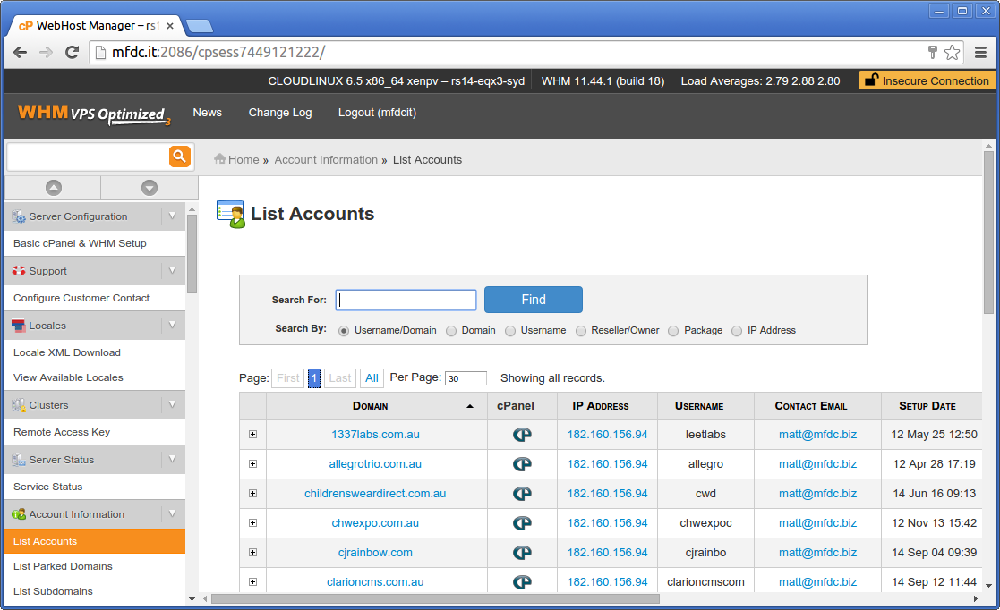
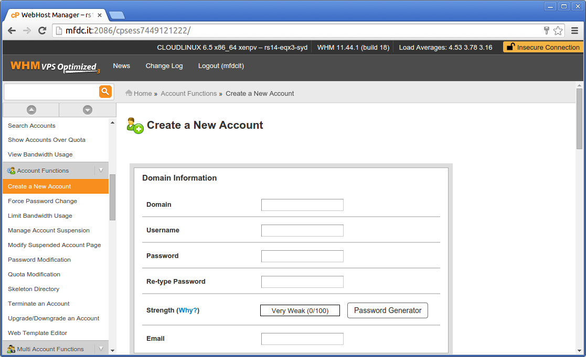

	

The Momsronomicon
=================
A concise and (not) complete list of the procedures, advice, tips and miscellany of [Mom's Friendly Development Company](http://mfdc.biz).

Development stack
=================
Here at Mom's there are two major project 'flavours': PHP and NodeJS.

PHP projects are largely legacy projects that are slowly being phased out. Its rare a new project would implement this platform but you may be asked to help maintain an existing project using this development stack. New modules may also be developed for existing PHP projects.

NodeJS is the current preferred method of project development at Moms. The temptation is to assume that since NodeJS is JavaScript it must behave exactly the same as regular browser JavaScript - this is not true, there are quite a few major differences. Because of this we treat frontend (i.e. what the browser does) and backend (i.e. what the server does) as two entirely different programming environments.

PHP Dev Stack
-------------
**NOTE:** We are moving _away_ from PHP for all future projects. See the [NodeJS Dev Stack](#NodeJS Dev Stack) section for current practicles. This section is left here for reference.

The PHP Dev stack uses the following:

* Linux based web-hosting using Apache
* HTML, CSS and JavaScript - the basics of web-page creation
* [jQuery](http://jquery.com) - With optional plugins
* [AngularJS](http://angularjs.org) - Frontend JS framework
* [PHP](http://php.net) - Server side language
* [CodeIgniter](http://codeigniter.com/user_guide) - An MVC framework for PHP
* Git / [GitHub](https://github.com) - For project management

I wouldn't worry about most of the above if you've not come across them before. The largest hurdle will be picking up CodeIgniter first.

[CodeIgniter](http://codeigniter.com/user_guide) is an [MVC framework](https://en.wikipedia.org/wiki/Model%E2%80%93view%E2%80%93controller) for PHP.
PHP is a programming language that, as you may already know, can quickly get out of hand when projects grow to anything more than one page websites. PHP is not alone in this, most higher level languages (HLLs) usually have the language as a baseline then add a framework to implement a specific function. For example Perl is a programing language Mason is its framework for generating web pages. JavaScript/NodeJS is a language, Express is the framework for web apps etc.

MVC tries to tidy up development by implementing what is known as the [Principle of Least Astonishment](https://en.wikipedia.org/wiki/Principle_of_least_astonishment). The aim of this is when you look at someone else's project or someone looks at yours - regardless of however many hundreds of files you have comprising that project - it should be possible to immediately jump to the function, page or construct that you are looking for.

What I would suggest is to have a read though the [CodeIgniter site](http://codeigniter.com/user_guide). Its generally written in a user friendly way with good [Starter material and videos](http://codeigniter.com/tutorials/). After you think you've got a grip on how everything works try putting together a simple project that involves a few different conceptual entities.

More about PHP and CodeIgniter can be found in the [CodeIgniter projects](#php--codeigniter-projects) chapter.

NodeJS Dev Stack
----------------
The NodeJS Dev stack uses the following:

* Linux based web-hosting using OpenShift or dedicated servers
* HTML, CSS and JavaScript - the basics of web-page creation
* [jQuery](http://jquery.com) - With optional plugins
* [AngularJS](http://angularjs.org) - Frontend JS framework
* [NodeJS platform](http://nodejs.org)
* [Express](http://expressjs.com)
* Git / [GitHub](https://github.com) - For project management

More about NodeJS projects can be found in the [Backend NodeJS projects](#backend-nodejs-projects) chapter.

Starter projects
----------------
A frequently asked question is for an example project which allows the newbie programmer to quickly explore a new environment.

Some ideas (listed beginner to advanced):

* **FizzBuzz (beginner level)** - [Fizzbuzz](https://en.wikipedia.org/wiki/Fizzbuzz) is a standard beginner-level programmer test. Generally a potential programmer should be given a whiteboard marker and asked to plot out how to solve the FizzBuzz test - "Output the numbers 1 to 100, every 3 numbers output 'Fizz', every 5 output 'Buzz' if the number is both 3 and 5 output 'Fizz Buzz'".

* **Twitter (basic level)** - A Twitter clone tends to be simple enough not to get too frustrating but involve enough objects (users, posts, tags) to keep it interesting. Start with a simple project that views individual tweets, after that look into implementing a user login system (next point) or tagging system.

* **Login system (mid level)** - Since a login system includes the need for a database, controllers to manage the process and models to manage the data a login system provides a end-to-end example project which should encompass all elements of a project.

* **User management system (higher level)** - Building off the above idea of a login system is the extended concept of an admin managing user accounts. This includes the ability to list, edit, create and delete accounts as per the CRUD / BREAD methodologies listed below.

Projects
========
> Programs are meant to be read by humans and only incidentally for computers to execute
> - H. Abelson and G. Sussman (Structure and Interpretation of Computer Programs)

Each project should include at least a `README.md` file to describe the project either with instructions on how to install it _or_ a Makefile / Grunt / Vagrant config file to do the installation on their behalf.

Unbreakable rules with projects:

* All projects should work out-of-the-box as far as possible. Excepting databases (which _always_ need installing and fiddling with) your project should work immediately after `git clone`. Failure to follow this rule will result in damnation and/or Matt killing you.
* Database schemas should be *human readable* - Do not just dump `mysqldump` / `mongodump` into a file. It should be readable and less than 1mb (don't dump a terabyte of SQL into a file and call it good). Failure to follow this rule will result in Matt killing all your pets (if you do not have any pets, Matt will by you some then kill them over your keyboard).
* You may see folds in existing code these resemble three opening or closing braces e.g. `Some code {{{ ... }}}`. These are flags to a text editor that the text between the braces should be grouped with a labeling comment. This is helpful to gather large related blocks of code together and make the source code more readable.

Package managers
----------------
There are quite a few package managers out there. We've found that the following work quite well:

* **[Bower](http://bower.io)** - This is probably the package manager that will get the most use. Its centered specifically on front-end code (mainly JavaScript and CSS) and works fine with any project.
* **[Composer](http://getcomposer.org)** - A package manager specifically for PHP, this provides a nice simple Object Orientated interface that takes advantage of PHP's Magic loading (i.e. `$foo = new BarObject()` will magically load whatever files `BarObject` lives in).
* **[NPM](https://www.npmjs.org)** - Used usually for backend JavaScript / NodeJS dev only.
* **Everything else** - As previously stated, dump everything else in `/lib` so everyone at least knows its an external component.

All three package managers dump their files in their own folders (`/bower_components` for Bower, `/vendor` for Composer and `/node_modules` for NPM). Composer and NPM also update their own config files (`/composer.json` and `/package.json` respectively).

All files (config files and downloaded files for each submodule) should be included within Git. For example if you install Bootstrap via bower (i.e. `bower install bootstrap`) the created folder (`/bower_components/bootstrap`) should be committed into Git on your next push. The principle here is that someone cloning your project from scratch should be able to get your project running _without_  needing to re-run the package manager to pull in all the prerequisites (e.g. `bower install`, `npm install`, `composer install` on each pull).

An exception to the above can be made for open-source components (not full projects). For example a widget that belongs in its own Git repo may omit any pre-requisite packages as the package manager will download and install these within the parent project anyway.

Version control - Git
---------------------
> And when I *do* get involved with the code, it's not because it's "cool", it's because it broke, and you'll find me cursing the people who wrote it, and questioning their parentage and that of their pets
> - [Linus Torvalds](http://meta.slashdot.org/story/12/10/11/0030249/linus-torvalds-answers-your-questions)

Git is the de-facto version control system of choice in MFDC. [GitHub](https://github.com) the preferred distribution server.

General tips:

* Pull as often as possible to prevent future merging problems - 90% of issues with Git are due to a coder not pulling enough and working on already-patched code.
	* Always pull before starting a new feature/bugfix

* Commit as often as possible. Its better to commit small chunks that fix individual errors than one large commit which will take ages to unpick if someone else only wants one feature of your commit.
	* Learn to use `git add -p` (git add patch), this allows you to selectively add bits of your code to a commit. This is extremely useful to pick out bits of code from an exceptionally large patch and label them correctly.

* Commit comments are mandatory. This is enforced by Git anyway but please try to be at least a little descriptive of your commit. Generally we go with the 'one line description' method of committing (don't go nuts) but multiple lines are advised if you use any of the below prefixes (one per line)
	* Some example prefixes we find useful:
		* `CLIENT: xxx` - The client asked for something specific even if the dev thinks its stupid
		* `BUGFIX: xxx` - This commit includes a correction to a bug
		* `REFACTOR: xxx` - This commit includes code cleanup which does not effect the operation of the code (improved comments, indentation fixes etc.)
		* `REVERT: xxx` - Revert of a previous commit (Git uses this prefix automatically anyway)
* Branching is only necessary on 'live' projects or if you are making an especially large commit that may break things. If the project is being developed and it is not mission critical or live then committing to master is good as it allows everyone to test everyone elses code.
* Do not push broken code _ever_, under any circumstances. A push should indicate that the code you are pushing has been completed and is ready at least for testing. Buggy or broken code that breaks everything will result in the WOM (Wrath of Matt).

General coding style
--------------------
The following is the recommended style for coding. MFDC is a small company with a good deal of flexibility so we don't really want to enforce the below too much. Most of the below is really just habits we've picked up as a company over the years. The following is aimed at providing a suitable consistent environment over projects and between programmers. We promise not to get mad if you use something different from the below if it can be justified. Sometimes some projects have different styles so the below is by no means definitive.

* **Indentation** - [One-True-Brace / 1TBS style](https://en.wikipedia.org/wiki/One_true_brace#Variant:_1TBS). While other styles occasionally exist and are tolerated (albeit grudgingly) 1TBS is preferred.
* **[Goto statements](https://en.wikipedia.org/wiki/Goto)** - No. None. At all. Under any circumstances. You know the bit about us not getting mad if it can be justified - this does not apply here. Violence will ensue. There will be blood.
* **Global variables** - Contrary to what your computer science professor may have told you, global variables will not cause Satan to reclaim the earth. Sometimes they are justified. Don't be afraid to use them.
* **Inline documentation** - Please learn about [phpDoc](http://phpdoc.org/), [jsdoc](https://github.com/jsdoc3/jsdoc) or one of the other inline documentation systems. See any of our existing projects for examples. Its not necessary to document every little thing, but documentation should be atomic - i.e. its either there and complete (listing all `@param` and `@return` parameters at a minimum) or not present at all. *Do not have half-completed documentation* as this is often worse than having none at all.

See each individual project type in the next section for language specific styles.

PHP / CodeIgniter projects
==========================
PHP and CodeIgniter is being phased out here at MFDC but there are still a lot of legacy software projects around which may require maintenance or new additions.

PHP
---
PHP is one of the two major programming languages at MFDC (the other being the front-end JavaScript code). While likely to change in the future (to NodeJS), PHP remains with us as our primary development language.

Ok lets get the bad things out of the way to start with. There are [lots of faults with PHP](https://maurus.net/resources/programming-languages/php) but lets just concentrate on those that effect us as a company and you as a dev:

* [Functions, parameters and return values are inconsistently named](http://tnx.nl/php.html#args), not in a logical style or just plain suck. Is it [Needle, Haystack](http://au1.php.net/manual/en/function.explode.php) or [Haystack, Needle](http://au1.php.net/manual/en/function.strpos.php), is it [Compound function names](http://au1.php.net/manual/en/function.isset.php) or [Underscore function names](http://au1.php.net/manual/en/function.is-array.php). The language is a mess.
* Object Orientation is just **bad** - While classical OO techniques such as inheritance do exist, more modern techniques such as introspection or [Duck Punching](https://en.wikipedia.org/wiki/Duck_punching) are either unsupported or involve workarounds which are painful to code.
* The PHP organisation committee appear to be taking whatever the opposite of LSD is - something that makes you increasingly more boring and pedantic. Their rejection of some perfectly sensible additions to the language is [nothing short](https://wiki.php.net/rfc/keywords_as_identifiers) of [baffling](https://wiki.php.net/rfc/named_params).

And now for the good news:

* PHP is extremely easy to learn if you have a rough background in *any other* language.
* It is entirely output agnostic allowing you to output HTML just as easily as JSON, XML, [images](http://au1.php.net/manual/en/book.image.php) or even [Flash](http://au1.php.net/manual/en/book.swf.php) (remember that!?).
* *Because* the Object Orientation is so bad (see above) most of the internal functionality is plain flat (admittedly globally namespaced) functions. Need to calculate an [MD5 hash](http://au1.php.net/manual/en/function.md5.php), the function is called `md5()` no external `import`, `require`, `uses` or other means of bringing in a module is required. No hunting though object stacks or trying to remember the exact name of the library like in [Python](https://docs.python.org/2/library/hashlib.html) or [Perl](https://metacpan.org/pod/Digest::MD5) is required. Don't believe me? The function to return the local date format using JavaScript/WinJS is `Windows.Globalization.DateTimeFormatting.DateTimeFormatter.shortDate.format()`, in PHP its `date()` and you pass it a [format](http://au1.php.net/manual/en/class.datetime.php#datetime.constants.types).
* Cross platform - PHP is hands down the most cross platform language this author (MC) has ever used. Yes this is a controversial thing to say, yes I can back it up. Bring it on.

In conclusion, what usually happens, as with any other language that has its horrible bits (I'm looking at *you* JavaScript) is someone comes along and builds a framework over the top to abstract away the horribleness of the general language. Enter CodeIgniter...

CodeIgniter
-----------
> PHP is a minor evil perpetrated and created by incompetent amateurs, whereas Perl is a great and insidious evil, perpetrated by skilled but perverted professionals
> - Jon Ribbens

CodeIgniter generally follows a pretty strict layout (all controllers live in `/application/controllers`, all models in `/application/models` etc.) so there isn't too much to add here except various tips we've picked up over the years:

* Controllers should always be named after plural nouns (e.g. 'users', 'devices', 'widgets', 'pages'). This usually approximates the database table structure as each controller should generally have a CRUD structure (see next point).
* All controllers should have the majority of a CRUD structure (Create, Read, Update, Destroy). This is a checklist for functionality with each entity in your system in that each entity should be creatable, readable (displaying it, can be combined with update), updatable (editable in other words) and destroyable (deletable). Sometimes not all entities will have a delete or create (if they are fixed entities within a table for example) but at least ONE of the CRUD system should be present.
* Models should be named in the singular noun. These usually match the controller names (e.g. if the controller is 'users' the model is 'user'). This is annoying and sometimes confusing but a necessary work around for the MVC system where controllers and models usually have at least a one-to-one relationship (i.e. each controller usually has a corresponding model).
* Views should be created in a nested directory system named after the controller. e.g. if the controller is named 'users' the folder `/applcation/views/users` should exist. All files within that folder should usually correspond to the function name within the controller. So if the controller has a function called `login()` the file `/application/views/users/login.php` should correspond to that view.
* Controller should pull in models and views as needed but models and views should avoid having to rely on other models or views. This point is not always followed but attempts to enforce encapsulation and independence.
* Populate `/application/config/autoload.php` with as _few_ entities as possible. Remember that each entry here gets loaded on _every_ page view.
* We usually use a special library called `site` which lives in `/application/libraries/site.php` this file contains a basic templating system as well as some handy functions which can be called globally.
* A database schema file should be located in `/database/Schema.sql`
	* The schema file should work immutably - i.e. must contain `DROP TABLE IF EXISTS foo;` statements to completely recreate the DB if needed
	* The schema file should contain example INSERT statements where practical to allow another coder to quickly recreate a test environment
	* Since everyone seems to have their own Database setup its usually a good idea to name your desktop/laptop something unique and add a rule for that name in the `/application/config/database.php` file. See an existing project for examples.
* All third party libraries and submodules live in `/lib`. This makes it easy to manage what is part of this project and what are libraries from elsewhere. See the [Package managers](#package-managers) section for more information on 3rd party libraries.
	* If a third party lib is to be used in the project its recommended to make a view inside `/application/views/lib` to load its CSS, JavaScript and HTML. e.g. if there is a 3rd party WYSIWYG editor make a loader for this in `/application/views/lib/wysiwyg.php` which can quickly load all its dependencies.
	* The first place to look for 3rd party libraries is Composer (see [Package managers](#package-managers)) before just cloning a 3rd party Git library into a folder.
* JavaScript files live in `/js`, CSS files live in `/css`.
* Normally a site has a Bootstrap based theme which can expose multiple JS and CSS files these files should *not* be modified (the theme may be updated at some later stage and your changes lost), instead create a file such as `/css/global.css` to override the CSS you may wish to alter aside from the main theme.
* Try to use constants in place of literal strings. For example `SITE_TITLE` is useful to specify whatever the site is currently called. These should live in `/application/config/constants.php`.
* CodeIgniter's provided [session library](http://ellislab.com/codeigniter/user-guide/libraries/sessions.html) is pretty poor and doesn't really serve a purpose. Using the default PHP `$_SESSION` variable is perfectly fine. You will need to add `session_start()` at the bottom of `/application/config/config.php` for new projects to enable this.
* Stick all writable content into `/data`. Examples include things like uploadable pictures or other content. We would recommend making separate sub-folders for each controller such as `/data/foobar/123` (where 'foobar' is the controller and '123' is the DB item that links to it).

MySQL Databases
---------------
> There are only 3 numbers of interest to a computer scientist: 1, 0 and infinity
> - [The Zero One Infinity Rule](https://en.wikipedia.org/wiki/Zero_one_infinity)

Databases are a pain to maintain. They nearly always require installation and sync on installation.
The best way we have found to manage them is to hand code the SQL to create the schema and place it in `/database/Schema.sql`. This file is then usually loaded into a server side MySQL database on load. See an existing project for examples of both this file and a Makefile to load it correctly.

One day we will find a nicer method to manage databases. On that day Satan will have difficulty getting into work due to snow issues.

General tips when creating your database - these are all purely advice and can be ignored as necessary:

* **Casing** - Always lower case, always. Having to hunt though schema files to find if a field is called 'userid', 'UserId', 'UserID', 'userId' or 'userID' will result in death or a Microsoft Certification.
* **Hungarian Notation** - If you don't know what this means: Congratulations! You are either too young or have never worked for Microsoft. Hungarians or their notations will be beaten to death with their own clogs.
* **Seperators** - Use of '_' is recommended for table and field seperators where its not immediately obvious (e.g. 'car_model', 'favourite_color') but can equally be ignored (e.g. 'carmodel', 'favourite_color') depending on preference.
* **Table names** - Are plural nouns (e.g. 'users', 'cars', 'devices', 'locations', 'hair_styles'). Yes this gets annoying because of the English language (e.g. the plural of sheep is sheep, battery is batteries etc.)
* **Primary keys** - Generally its a good idea to use the singular noun table name followed by id with no spacing (e.g. 'userid', 'carid', 'deviceid', 'locationid')
* **Linkage tables** - These are tables that complete a many-to-many relationship. Generally either the 'foo2bar' format or 'foo_to_bar' format are both fine (e.g. 'users2tags', 'users2cars', 'users_to_locations', 'users_to_devices')
* **Indexes** - Learn what `CREATE INDEX` is and [what it does](https://dev.mysql.com/doc/refman/5.0/en/create-index.html). This should follow every `CREATE TABLE` statement to tell the database which fields to index. Any field that has a large number of read filters should be indexed. For example if you use 'users.email' or 'users.username' to identify a user when logging in - index that field! If your application is running slow its usually because you forgot to index something you are reading / filtering by excessively without indexing it.
* **DELETE** - Not so much a database issue, this is usually in the HLL (e.g. CodeIgniter). In 90% of cases a record should never be deleted. Instead add a column to indicate status (e.g. `CREATE TABLE ... status ENUM('active', 'deleted') DEFAULT 'active' ...`). Deleted records cause havoc in later statements and make reporting of historical data impossible. Possible exceptions include linkage table rows and 'temporary' tables such as shopping baskets etc.
* **Varchar / BLOB** - Varchars can have a maximum length of 255. Any content that is likely to exceed this should be created as a BLOB / CBLOB. In MySQL this data type is 'TEXT' (e.g. `CREATE TABLE ... content TEXT...`). TEXT fields cannot be indexed so if you want to lookup by value you should use `VARCHAR(255)` instead - email addresses should always be `email VARCHAR(255)`.
* **Usernames** - Dealing with user logins can be an issue later on if any OAuth is added to the application. We recommend you add a field called `username` to all 'users' tables and index that. Even if your application ONLY accepts email as the login at present copy the contents into this field. Trust us, it makes life easier when the client asks for OAuth via Facebook login or something.
* **User firstnames / lastnames** - You can save yourself a lot of pain and anguish by only asking for the users name (e.g. 'John Smith') rather than a first and last name. Letting the user enter whatever they want is always preferable than forcing the first/lastname convention on them. This is the most frequently bypassed tip so don't feel bad if the user insists on firstname/lastname fields instead.
* **Dates / epocs** - Dates within a database should always be stored as [UNIX epochs](https://en.wikipedia.org/wiki/Unix_epoch). Epochs are a simple integer of the number of seconds since 1970-01-01 00:00. This makes maths on dates extremely simple (e.g. to add a day simply increment by the number of seconds in a day - 60*60*24) and easy to deal with.
* **Refering to dates** - Dates outside of Unix epochs such as human readable dates (e.g. in comments or elsewhere) should be noted in big-endian [ISO 8601](http://en.wikipedia.org/wiki/ISO_8601) format. Since we work with a lot of external devs this prevents confusion, it also means named files sort logically (year first, day last). Its also a format non-programmers can pick up without prompting, use it, you'll like it.

PHP / Apache environment setup
------------------------------
> Programming is 1% inspiration, 99% trying to get your environment working.
> - [Hacker News](https://twitter.com/HackerNewsOnion/status/390883204967567360)

For the PHP / CodeIgniter / MySQL development stack you will need to have Apache + PHP running somewhere to actually test what you're developing.

I would suggest Linux if you are familiar with it (and its a simple `sudo apt-get install lamp-server^` to install) or using [XAMPP](https://www.apachefriends.org/index.html) for Windows or Mac.

The following commands pasted into a Bash shell should set everything up on a Debian / Ubuntu based system:

	sudo apt-get install -y lamp-server^
	sudo perl -pi -e 's/^display_errors = .*$/display_errors = On/g' /etc/php5/apache2/php.ini
	sudo perl -pi -e 's/^short_open_tag = .*$/short_open_tag = On/g' /etc/php5/apache2/php.ini
	sudo perl -pi -e 's/AllowOverride .+$/AllowOverride all/g' /etc/apache2/sites-available/*default*
	sudo ln -s /etc/apache2/mods-available/rewrite.load /etc/apache2/mods-enabled/rewrite.load
	sudo service apache2 restart
	echo "Don't forget to update your database information in /application/config/database.php"
	echo "You may also need to point /var/www to where your project lives. The following will set that up:"
	echo
	echo "    sudo rm /var/www -r; sudo ln -s /where/your/project/is /var/www"
	echo

If you want to set up your environment yourself you may find the following tips useful:

* Make sure PHP has `short_open_tags` set to `on` in the php.ini file (XAMPP for some mysterious reason ships without this)
* You may also wish to set `display_errors` to `on` so you actually get errors displayed on screen rather than PHP just returning a blank page and sulking if you make a syntax error
* You will also need a suitable database environment such as MySQL (don't forget to tweak your database settings in `/application/config/database.php` for CodeIgniter projects
* You will need to set `AllowOverride` to `all` in all cases in `/etc/apache2/sites-available/default` to allow Apache to process `.htaccess` files
* You *may* need to enable Apaches `mod_rewrite` depending on the distro
* All our projects assume that the project is installed as the root of the site. We do this to avoid having to figure out where resources are located (as its always easier just to add a prefix `/` at the beginning of all links). This means that you will need to either install the site in Apaches document root *or* clone the repo elsewhere and set `/var/www` as a symbolic link pointing to it. You may find projects like [WWWSet](https://github.com/hash-bang/Bash-WWWSet) helpful to automate this process.

PHP / CodeIgniter project coding style
--------------------------------------
Try to use short tags where possible:

	//Correct & neat
	<?=$foo?>

	// All the following are overly long and complex but are syntactically the same:
	<?php echo $foo; ?>
	// OR
	<? echo $foo ?>
	// OR
	<?php print $foo; ?>

The same goes for loading objects in CodeIgniter/PHP:

	// Correct
	<? $this->load->helper('form') ?>

	// Wrong - Takes up too much room and overly complex
	<?php
	$this->load->helper('form');
	?>

Please use the standard C syntax rather than the alternate PHP syntax:

	// Correct
	<? if ($widgets) { ?>
	<ul>
		<? foreach ($widgets as $widget) { ?>
		<li><?=$widget['name']?></li>
		<? } ?>
	</ul>
	<? } else { ?>
	
No widgets found

	<? } ?>

	// Wrong (and weird)
	<? if ($widgets): ?>
	<ul>
		<? foreach ($widgets as $widget): ?>
		<li><?=$widget['name']?></li>
		<? endforeach; ?>
	</ul>
	<? elseif: ?>
	
No widgets found

	<? endif: ?>

Backend NodeJS projects
=======================
> Java is to JavaScript what Car is to Carpet
> - Anon.

Project layout
--------------
After experimenting with a variety of different project layouts we have found that the following works quite well for NodeJS projects:

The project tree breakdown is listed below. For each path an 'edit chance' is given (i.e. the possibility of the developer needing to change the contents of that directory) and a brief description.

| Path                                                | Edit chance | Description |
|-----------------------------------------------------|:-----------:| ------------|
| `/`                                                 | Rare        | Root project directory |
| `/app/`                                             | Common      | Root Angular directory. See the [Angular](#frontend-javascript-projects) chapter for more details |
| `/bower_components/`                                | Never[1]    | Install directory for all Bower controlled packages |
| `/build/`                                           | Never[2]    | Generated files directory |
| `/config/`                                          | Rare        | Storage for all config scripts read at startup, see `global.js` for default config setup. Other files are read depending on the `NODE_ENV` setting |
| `/config/global.js`                                 | Never       | Base config file showing default variables subsequently overridden by each `NODE_ENV` config file |
| `/config/private.js`                                | Rare        | Private config details. This file is listed in `.gitignore` and should *never* be checked in to GitHub as it can contain private details - e.g. database connection passwords or API keys |
| `/controllers/`                                     | Common[3]   | All Express controllers (one per JS file) |
| `/models/`                                          | Common      | Schema and method definitions for all project models (one per JS file) |
| `/models/data/`                                     | Low         | Sample population data for all models |
| `/node_modules/`                                    | Never[1]    | Install directory for all NPM controlled packages |
| `/public/`                                          | Common      | Directory containing all static files |
| `/views/`                                           | Common      | Directory containing all dynamically generated files |
| `/views/layouts/`                                   | Low         | Main layout template directories (one per JS file) |

Notes:

1. These directories are managed by package managers like NPM and Bower. The user should never need to manually edit the contents of these directories.
2. The contents of `/build` are read-only as they are generated by Gulp and will be overwritten on every compile cycle.
3. All files in this directory are read and included in the main `server.js` core file and are really just dumb includes.

JavaScript coding style
-----------------------

* **Var** - Var must always be used in each function otherwise a variable becomes global (JS is the only language that does this). If you don't know what `var` means, learn.

Frontend JavaScript projects
============================
When we say 'Frontend JavaScript' we usually mean [AngularJS](http://angularjs.org), although there can also be a bit of [jQuery](http://jquery.com) thrown in to do some of the more complex DOM manipulation.

Frontend coding style
---------------------
Most of the same JavaScript styles under the [NodeJS backend chapter](#javascript-coding-style) are also applicable to Angular / Frontend JavaScript. The below is specific to Angular projects.

FIXME

Stuff you might not know about AngularJS:

* `{{::foo}}` will template 'foo' exactly once and never update it again - this makes the DOM lightning fast if you only want Angular to insert the value of a variable once.
* Adding `track by` to `ng-repeat` elements hugely speeds up DOM refreshes when using repeats e.g. `

`. ngRepeats normal behaviour is to remove all elements and re-insert on an array change, using `track by` allows inserts and removals of elements but leaves existing DOM elements alone - preventing costly DOM removal/reinsert behaviour.

Project layout
--------------
After experimenting with a variety of different project layouts we have found that the following works quite well for AngularJS projects:

The project tree breakdown is listed below. For each path an 'edit chance' is given (i.e. the possibility of the developer needing to change the contents of that directory) and a brief description.

| Path                                                | Edit chance | Description |
|-----------------------------------------------------|:-----------:| ------------|
| `/`                                                 | Rare        | Root project directory |
| `/app/`                                             | Common      | Root Angular directory |
| `/app/app.js`                                       | Rare        | Main Angular initializer file |
| `/app/routes.js`                                    | Common[1]   | Main Angular initializer file |
| `/app/controllers/`                                 | Common      | Angular controller directory |
| `/app/controllers/global.js`                        | Common[2]   | Angular rootScope controller |
| `/app/directives/`                                  | Common      | Angular directives directory |
| `/app/filters/`                                     | Common      | Angular filters directory |
| `/app/models/`                                      | Common      | Angular models directory |

The above is sometimes subject to change depending on the backend environment or project layout. Sometimes the `/app` directory can be stored as `/js/app` or elsewhere in the file tree. As much as possible the inside of that directory should resemble the above layout though.

Notes:

1. Only applies if using the Angular [ngRoute](https://github.com/angular/bower-angular-route) module.
2. The Angular rootScope controller should be attached to the same element as the ng-app directive. e.g. `<body ng-app="app" ng-controller="globalController"></body>`.

Job descriptions
================
This section is to define a few categories developers can fit into. Sometimes a task may require multiple of these job descriptions, sometimes they may all the same person.

Business Analysts (BAs)
-----------------------
FIXME

Developer
---------
> Beauty is more important in computing than anywhere else in technology because software is so complicated. Beauty is the ultimate defence against complexity.
> - David Gelernter

FIXME

DevOps
------
> Remember, as a developer, the cost of breaking a live system to a client is: 
>  * The sum of wages of staff who can't do their job
>  * The opportunity cost in time for the company - what they could be making if it weren't for the system being down. 
>  * The loss of user trust in the system. 
>  * Any data loss that might have occurred. 
> 
> So... Since a day's downtime could run into thousands of dollars of expenses even for a minor fault, don't break the system.

DevOps is primarily a position specializing in the deployment and maintenance of live systems in an on-going basis (i.e. not just deploy and forget like most website uploads).

For larger projects where MFDC is in some way involved with development and making sure the thing still works (aka operations) there are a number of additional considerations that need to be made. Fundamentally, developers are no longer just builders who complete a task list, but are instead actively responsible for achieving two goals: Making sure existing functionality is not interrupted, making sure new deployments are achieved and most importantly, users are happy. 

**Requisites**

All DevOps people need to:

* Know enough Linux to install, say, a LAMP server
* be able to use a test-editor via the command line
* Use SSH, cron, tar
* Use the database via the command line
* Understand makefiles
* Have strong communication skills

**Branching**

MFDC doesn't have an official position on branching, but its often helpful when making significant system changes to branch the system with Git, achieve the changes and then re-merge them back into the main branch. _However_, make sure all the developers on the project understand this, lack of familiarity with branching by a junior developer will cause merry hell. 

**Initial deployment**

Once the client is happy for the system to go live:

1. Pull to server, make database, run install script. If there's anything more complicated, rethink it. Deployment has to be simple because it's where things to badly wrong. 
2. Confirm deployment: Make sure **everything** is working. Ideally unit-tests, failing that, a manual observation. 
3. Monitor response: Check with client/operations, monitor in the immediate few days of use the feedback. 

**Communication - the art of modifying live systems**

As a developer, all changes to live systems must be made known to the operations team. _Anything_ which affects the function of a website which is already in use must be run by them, even if only cosmetic. 

**Database changes**

Any modification to the database will critically change the live system. Running the simple makefile is not possible due to their being live data in the database. Field type changes are dangerous because there is the potential to lose live data. Therefore the entire issue is one which must be carefully monitored and performed flawlessly. 

1. Database Schema changes are all critically important. Track every modification of an existing system because deployment of the software without corresponding live schema updates is critical.
2. Ensure database backups before any modifications (as well as generally)
3. Create database update SQL files with a list of updates to run on the production server and _test them_.

**Disaster Fallout and blame**

Things break, when they do its the DevOps responsibility to fix it immediately, no matter who's at fault, the time of day or who's on call. Then find out where, how, when and what the lead-up to the event was.

* Remember everything is traceable through Git, so it's easy to figure out who wrote the line of code which broke the server, however, remember that whoever was in charge of deployment is ultimately responsible for the live build.
* After fixing, discuss what went wrong with all stakeholders and discuss how to avoid this in future. Future prevention is more important than blame. 

SysAdmin
--------
> UNIX was not designed to stop its users from doing stupid things, as that would also stop them from doing clever things.
> - Doug Gwyn

FIXME

Quality Control (QA)
--------------------
> Debuggers don't remove bugs. They only show them in slow motion.

FIXME

Support
-------
> PICNIC (Problem in chair not in computer)
> - General use acronym indicating a user is at fault

IT support can broadly be separated into three tiers: 1 though 3.

| Tier   | Also called                   | Description                                       |
|--------|-------------------------------|---------------------------------------------------|
| Tier 1 | Helpdesk / Helldesk           | First point of contact for the general public. Common questions and queries |
| Tier 2 | Troubleshooting / Deployment  | Generally 'the unseen' of IT. These are either the superiors (in experience) to Tier 1s or people setting up architectures (e.g. outfitting an office with hardware).
| Tier 3 | SysAdmins                     | Someone who normally administers the most complex systems in the infrastructure.
| Tier 4 | Externals                     | Not part of the usual Tier 1 - 3 this tier can be referred to when the problem exists outside of the infrastructure e.g. external vendors.

Deployment
==========

Managing cPanel via WHM
=======================
cPanel as a web hosting platform exists on two levels - the 'regular' cPanel that controls invidiaul accounts and something called WHM (Web Host Manager). In about 90% of cases when someone refers to cPanel they mean the former. As a web hosting company we have to manage multiple accounts which is why we use the later.

Logging into cPanel WHM
-----------------------
If you need to manage cPanel accounts you will have been provided with a super secret username, password and URL combination. Please don't misplace this as changing the master server password is a pain.

Login can be done via the URL provided with the details you should have.

You can adminster accounts by clicking `List accounts` in the left hand menu. Each of the small cPanel logos next to the site URL will log you in to that sites individual cPanel account.

Creating new cPanel hosting accounts
------------------------------------
To create a new account login to cPanel in the usual way and select `Create a New Account` from the left hand menu.

Fill in the form using the following information:

* **Domain** - The fully qualified domain name you wish to create the account for. e.g. 'widgets.com.au'
* **Username** - This will be auto-completed by the form but sometimes you may wish to tweak this the client is likely to remember it. Limited to 8 alpha-numeric characters.
* **Password** - Hit the `Password Generator` button select the `Advanced` popout and change the 'Non-alpha characters' section to the second option - 'Numbers'. This avoids the issue some clients can have when using passwords that contain strange symbols. See below for a screen shot of the recommended settings.
* **Email** - This should always contain `matt@mfdc.biz`. This email address contains general technical stuff so the client will not be interested in the contents of these mails anyway.
* **Package** - This allows the section of the resource profile the domain should be allocated as. In almost all cases you will require `mfdcit_basic`. If you require more resources for your site, please talk to Matt beforehand.
* **All other settings** - All other form settings including DKIM, SPF settings etc. can be left at their defaults.

On completion paste the generated password into an email to [me](mailto:matt@mfdc.biz) along with everything else.

The cPanel account you have created will double as the default FTP login details.

The client can access their own cPanel console via http://DOMAIN.com/cpanel, webmail is available via http://DOMAIN.com/webmail

Creating common website types - Wordpress, ZenCart etc.
-------------------------------------------------------
Each cPanel account has a number of installed applications.

One of these is Fantastico DeLux which can be used to quickly setup a site from a list of known installations.

Fantastico can be found under the 'Software / Services' panel in the sites cPanel area.

Use Fantasico to quickly setup common site types like Wordpress, ZenCart or generally any other PHP based site:

Clients
=======
> Tell me your problem, not the solution you think it needs
> - Motto of SAGE-AU

A handy reference for types of clients.

**The Hoopbringer**

These types of clients are generally smaller single person entities that have had an idea but haven't really thought though the ramifications. Mostly unmotivated to do anything other than talk about their idea, they normally cause more work for the company to pursue than they are worth.

Counteracted by identifying timelines and budgets in order to determine if there is an actual project. Suggesting a paid period of initial consultation (even if the money is minor) is a good barrier to determine if the client is serious.

**The Helicopter**

Named for clients who hover around and oversee your every move. To be avoided for obvious reasons as the majority of the project turns into meetings about progress rather than actually achieving any.

A variation on the Helicopter client is one where he or a member of the company *thinks* they have some experience with an aspect of the project - PM, BA, design or programming. This can quickly get out of hand as MFDC works better as a tight-knit company rather than having to outsource one aspect of the project to a client for one aspect of the process.

Counteracted by 'distracting' with smaller aspects of the project and trying to keep as much distance as possible. e.g. if the client wishes to concentrate on design provide him with Visio / Balsamiq (or a pack of crayons) and let him design away like mad while quietly working on your UI which (hopefully) will be more professional anyway. If this is not the case a quick round of focus testing usually points out the flaws and is useful for deflecting accusations to your own person. If the client *has* come up with something better then obviously use that, the company is not always right.

**Share options only**

Also known as *The Broke Client*.

Sometimes a client may not have any money to pay for development up front and/or have any means to do so in the immediate future. Sometimes this is acceptable if the project is worthwhile but generally this can lead to trouble.

Oddly in our experience the more humble the renumeration the more demanding the client so some means of compensation should at least be sought at any one time.

Should the sentence "we can pay you guys as soon as it starts making money" be said a klaxon should sound and the client be ejected from the premises.

This type of client should not be confused with a client which *has* money but refuses to pay for a milestone.

**Best friend clients**

Ideas can of course spring from inspiration all around us, so its inevitable that sometimes ideas may come from family, friends or others that have a close relationship to us.

While some of these projects can be genuinely tempting special bias must be placed on the awkwardness of working with personal contacts unless some degree of compartmentalization can be afforded.

Best friends clients can warp our sense of priority - usually making us over-value tiny changes in order to impress or justify our relationships. Additionally there is a strong temptation to reduce or forgo payment on a project all together because of friendship - this is to be avoided at all costs. The exchange of money, however minor, can cement the understanding that a project is at the professional level. *Never* do family or friend projects without *some* compensation or the immediate plans to obtain it.

Specification
-------------
> Walking on water and developing software from a specification are easy if both are frozen
> - Edward V Berard

FIXME

Project development
-------------------
> Hofstadter's Law: It always takes longer than you expect, even when you take into account Hofstadter's Law
> - Douglas Hofstadter

FIXME

Testing and Feedback
--------------------
> A computer lets you make more mistakes faster than any other invention in human history, with the possible exceptions of handguns and tequila
> - Mitch Ratcliffe

Interviewing Devs
=================
> Engineers are all basically high-functioning autistics who have no idea how normal people do stuff
> - Cory Doctorow

Alternate title for this section: "How to tell if a potential developer really knows what he is doing".
This section is intended as a rough guide to the dev skills we are looking for.

You may also find the [Starter projects](#starter-projects) section useful as it also provides some sample projects to give to potential employees.

Job description
---------------
A general use job description suitable for web-devs.

	Due to an upswing in projects we are seeking a coder with moderate to
	expert level expereience of PHP and/or NodeJS (specifically the
	CodeIgniter and ExpressJS frameworks respectively). Other skills such
	as database knowledge or general *nix experience are desirable but
	non-essencial if the candidate is willing to learn new skills.

	Essential skill set:
	* Intermediate written English skills
	* PHP 5 programming experience OR NodeJS programming experience
	* Experience with MVC systems or other structured framework models
	* HTML, CSS and JavaScript experience
	* Frontend framework knowledge - jQuery, Angular, Ember, Backbone or similar

	Desirable skills:
	* Ability to both write new code and maintain existing code-bases using a source control system - specifically Git
	* Experience of the PHP MVC framework CodeIgniter or equivelent (e.g. CakePHP, Symfony, Laravel)
	* Some database knowledge - MySQL, Mongo, Redis or similar
	* Expereince of a frontend design framework (ideally Bootstrap)
	* Expereince of a frontend framework stack (ideally Angular)
	* Experience with HTML5 + mobile app frameworks (ideally jQuery Mobile, Sencha or Ratchet).
	* *nix knowledge is considered a definite plus
	* Familiarity with inline documentation systems - specicially PHPDoc, JSDoc
	* General networking knowledge
	* Extra skills that may be useful: BASH coding, general *nix console usage

Past projects
-------------
> Good programmers do programming not because they expect to get paid or get adulation by the public, but because it is fun to program
> - Linus Torvalds

If the sites he references are pretty professional and well done - you need to ask him:

* What he has specifically contributed
* What framework was used with the sites
* Whether he has any opinions on it or other frameworks
* Ask for positive and negative points on the framework. Pay particular attention to negatives since this shows he has some compatible experience in other areas.

PHP Specific
------------
The key point with PHP is that the language is pretty much a sloppy mess and anything developed professionally needs a decent framework to prop it up so you can hand a project off to someone else to maintain.

The following phrases should set off alarms:

* "We don't believe in frameworks or don't use them" - Everyone is entitled to their opinion of course but this is where unmaintainable messes of code happen. If he can justify his decisions then thats ok, if not it is a good warning he hasn't looked beyond his own skill set.
* "I use my own framework" - This suggests someone who is at least proficient in the language but in the long run gives you even more of the problems associated than using a popular but lesser framework. Imagine someone saying "Well I wrote the book you wanted but did it in my own never-documented version of Gaelic. Now I'm leaving - good luck". As with the above, if a justification can be given then thats fine.
* "I do SEO" - SEO is to programming what HTML is to code - its not. This is only said by people who understand neither. If he has it listed on his CV as a sidenote then all is well. If he makes a big deal about it or it forms the central part of his skills - you may have a problem.

Instant aptitude questions - just add cynicism
----------------------------------------------
If the interviewee answers 'yes' to any of the following questions, don't bother to continue the interview:

* Do you think JavaScript and jQuery are the same thing?
* Have you ever named a function starting with "my", or your own name?
* Do you think VCS commit messages are optional?
* Have you ever written try/catch with an empty catch block?
* Have you ever written a CMS entirely with PL/SQL?
* Have you obtained a Microsoft Certification and if so did you pay for it yourself?

Other useful questions can be found at https://github.com/ChiperSoft/InterviewThis/blob/master/InterviewThis.md

Further reading
===============
The below is some recommended readings for various technologies.
MFDC usually has all of the book recommendations in both PDF and dead-tree formats

PHP
---

* [Book - Professional CodeIgniter](http://www.amazon.com/Professional-CodeIgniter-Thomas-Myer/dp/0470282452/ref=sr_1_1?ie=UTF8&qid=1399350667&sr=8-1&keywords=professional+codeigniter)
* [Tuts+ CodeIgniter from Scratch](http://code.tutsplus.com/series/codeigniter-from-scratch--net-17602)

JavaScript / AngularJS
----------------------

* [Book - AngularJS](http://www.amazon.com/AngularJS-Brad-Green/dp/1449344852/ref=sr_1_4?ie=UTF8&qid=1399350683&sr=8-4&keywords=angularjs)
* [Book - ng-book](https://www.ng-book.com)
* [AngularJS-StyleGuide](https://github.com/johnpapa/angularjs-styleguide) has some good (but advanced) tips for laying out AngularJS modules
* [Scotch.io](http://scotch.io) has an exceptionally good set of short articles on AngularJS functionality.
* [Reddit Angular wiki](http://www.reddit.com/r/angularjs/wiki/index)

JavaScript / NodeJS
-------------------

* [Book - Practical Node.js](http://www.amazon.com/Practical-Node-js-Building-Real-World-Scalable/dp/1430265957/)

Other style guides
------------------
* [Googles JavaScript style guide](http://google-styleguide.googlecode.com/svn/trunk/javascriptguide.xml)

Misc
----
* **Interview questions** - [InterviewThis](https://github.com/ChiperSoft/InterviewThis/blob/master/InterviewThis.md)

Tools
=====
> The easiest method to compute newbie programmer specific hash is to sit them in front of VI and ask them to quit.
> - MC, The author

Design tools
------------
We have generally found [Balsamiq mockups](http://balsamiq.com) to be the go-to prototyping system as it provides an excellent user interface capable of generating UI's with little overhead.

For ERD diagrams [LucidChart](http://www.lucidchart.com) is the best option we have found so far.

Everything else should be constrained to standard office tools - MS Office / LibreOffice etc.

Editors
-------
> I use emacs, which might be thought of as a thermonuclear word processor. It was created by Richard Stallman; enough said. It is written in Lisp, which is the only computer language that is beautiful. It is colossal, and yet it only edits straight ASCII text files, which is to say, no fonts, no boldface, no underlining. In other words, the engineer-hours that, in the case of Microsoft Word, were devoted to features like mail merge, and the ability to embed feature-length motion pictures in corporate memoranda, were, in the case of emacs, focused with maniacal intensity on the deceptively simple-seeming problem of editing text
> - Neil Stephenson (In the beginning was the command line)

> Vi is a subset of evil
> - Anon.

Despite any fancy pre-conceived notions there are only two text editors - [Emacs](https://www.gnu.org/software/emacs) and [Vi](http://www.vim.org). All other editors are shallow copies of one of these two - usually implementing less features. These editors pre-date the internet and as such have 

Thats not to say that other editors such as [Notepad++](http://www.notepad-plus-plus.org), [TextPad](http://www.textpad.com/), [Sublime Text](http://www.sublimetext.com) or the new hip-and-trendy [Atom](https://github.com/atom/atom) are necessarily bad, just that they more-or-less duplicate the functionality of either Emacs or Vi and in most ways not to the full degree.

Glossary
========
| Term                  | Definition                                            |
|-----------------------|-------------------------------------------------------|
| Backend               | See server.
| BLOB                  | Binary Large OBject - A large unspecified amount of data such as an image file in binary form.
| Bower                 | A package manager aim at front-end components developed by Twitter. See [Package managers](#package-managers)
| Bugfix                | A code commit that fixes a bug.
| Client                | Can either mean the person paying for a project OR in the context of "client end" this means stuff the browser runs like JavaScript.
| CMS                   | Content Management System. See WordPress.
| CodeIgniter           | MFDC's MVC PHP framework of choice.
| Commit                | A checked in, logged Git instance. This should correspond with a feature or bugfix.
| Composer              | A package manager aimed specifically at PHP. See [Package managers](#package-managers)
| Controller            | A part of MVC. A controller is the first point of call in a project and usually represents a plural noun e.g. 'users'.
| CRUD                  | Create, Read, Update, Destroy - The four operations that (most) controllers in an MVC application should implement for all tables to be considered complete.
| DB                    | DataBase. Used interchangeably.
| Dev                   | Developer. You.
| DevOps                | A different breed of a developer. DevOps is primerily concerned with system deployment and maintenance of Dev produced products.
| Epochs / Epoc         | A method of storing time. An Unix Epoch is equal to the number of seconds since 1970-01-01 00:00:00 in UTC
| ERD                   | Entity Relationship Diagram. A typical diagram showing the layout of a relational database structure
| Git                   | A package management system. Known for being developed by Linus Torvalds and its excessive use of tree diagrams in its documentation.
| GitHub                | Website specializing in the storage of Git Repos
| HLL                   | Higher-level-language. Any modern programming language such as PHP or JavaScript
| Index                 | In database terms, the ability for a field to be quickly retrieved. Primary keys are always indexed.
| JavaScript            | Client side interpreted programming language. Often compared to a 5th level Higher-Level-Language (HLL)
| JS                    | Short hand name of JavaScript.
| MFDC                  | Mom's Friendly Development Company. Provider of coffee to the downtrodden devs of the world
| Model                 | A part of MVC. A model is the gateway to the database.
| MVC                   | Model-View-Controller. A strategy to develop reasonably clean applications. 
| MySQL                 | Database server of choice. Now owned by Oracle but has yet to turn evil.
| NPM                   | Node Package Manager. Used only for JavaScript heavy projects. See [Package managers](#package-managers)
| OAuth                 | A method of quickly turning a project into a living nightmare. Developed by Facebook to assist cross-site logins.
| OO                    | Object Orientation. A manner of programming similar to bureaucracy where everyone points the finger at everyone else and no-one seems to do any work.
| PHP                   | A minor yet necessary evil. Also an interpreted programing language for server side development.
| Repo                  | Repository. This term usually means a single Git project instance.
| SEO                   | Search Engine Optimization. A method to keep all the arseholes of the world under one job description. See Voodoo.
| Server                | An owned, private resource.
| SysAdmin              | Systems Administrator. Usually the root level administor of a server or cluster.
| Text                  | General designation for any, potencially infinite, amount of textual data. Can usually compare to a BLOB.
| UTC                   | Universal Time Code. A modern saying as no-one knows where "Greenwich" is.
| View                  | A part of MVC. A view is usually raw output that should be sent to the browser.
| Voodoo                | "I fixed it and I have no idea how".
| WordPress             | CMS usually dedicated to smaller, static paged projects.

