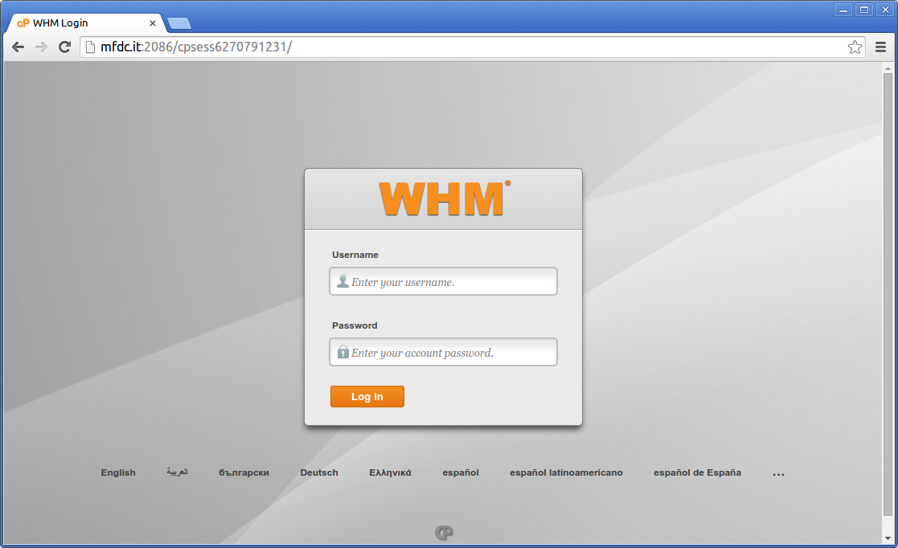
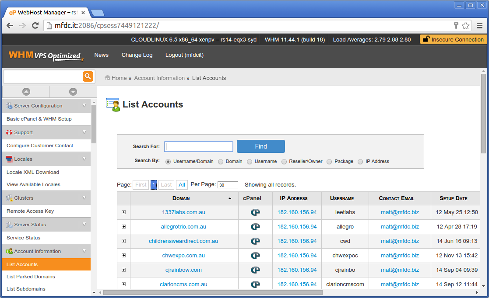
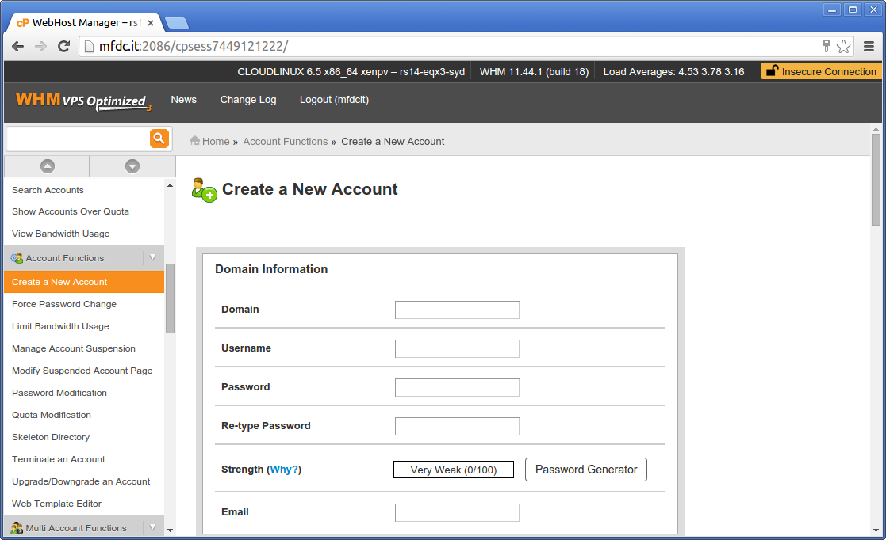
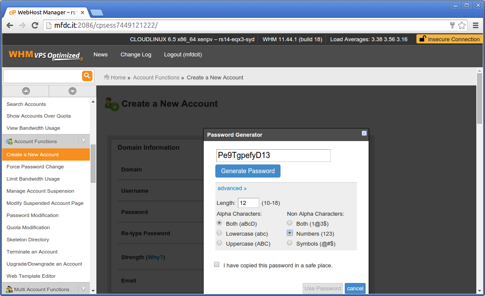
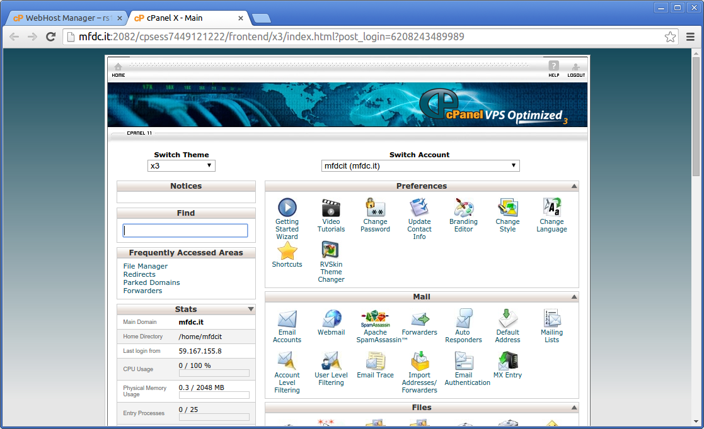
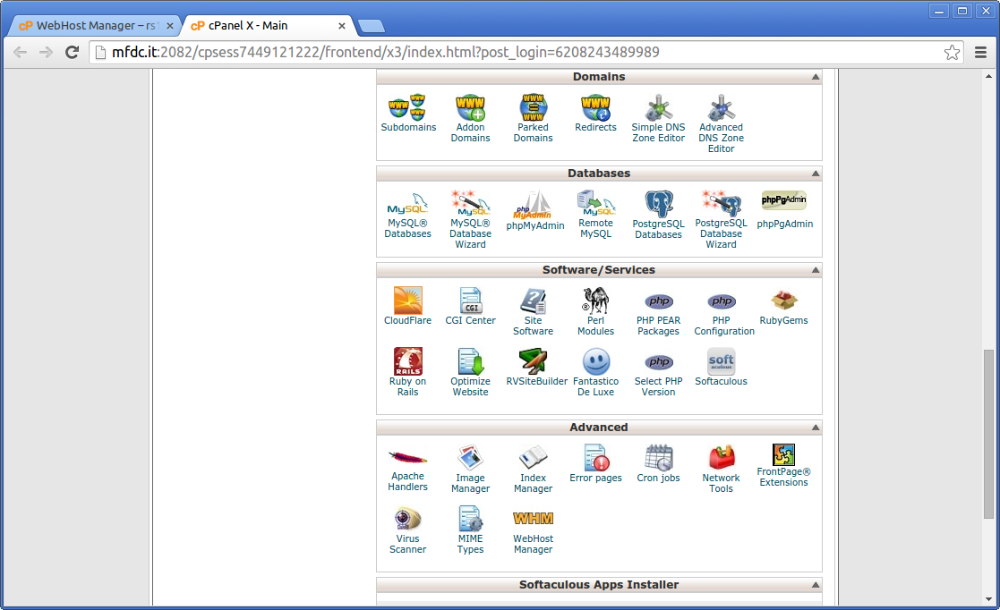
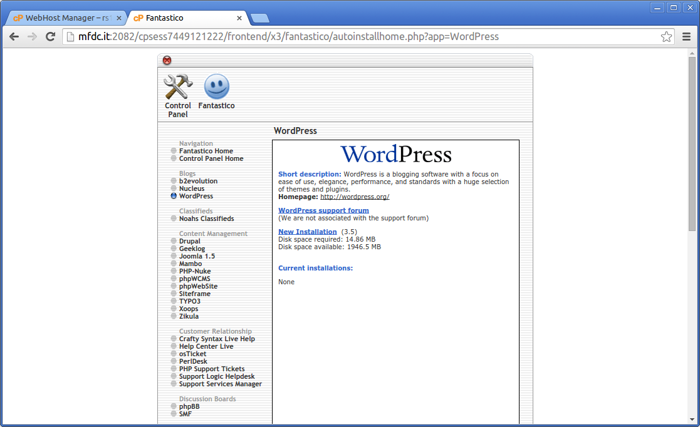

Deployment
==========

Managing cPanel via WHM
=======================
cPanel as a web hosting platform exists on two levels - the 'regular' cPanel that controls invidiaul accounts and something called WHM (Web Host Manager). In about 90% of cases when someone refers to cPanel they mean the former. As a web hosting company we have to manage multiple accounts which is why we use the later.

Logging into cPanel WHM
-----------------------
If you need to manage cPanel accounts you will have been provided with a super secret username, password and URL combination. Please don't misplace this as changing the master server password is a pain.

Login can be done via the URL provided with the details you should have.

You can adminster accounts by clicking `List accounts` in the left hand menu. Each of the small cPanel logos next to the site URL will log you in to that sites individual cPanel account.

Creating new cPanel hosting accounts
------------------------------------
To create a new account login to cPanel in the usual way and select `Create a New Account` from the left hand menu.

Fill in the form using the following information:

* **Domain** - The fully qualified domain name you wish to create the account for. e.g. 'widgets.com.au'
* **Username** - This will be auto-completed by the form but sometimes you may wish to tweak this the client is likely to remember it. Limited to 8 alpha-numeric characters.
* **Password** - Hit the `Password Generator` button select the `Advanced` popout and change the 'Non-alpha characters' section to the second option - 'Numbers'. This avoids the issue some clients can have when using passwords that contain strange symbols. See below for a screen shot of the recommended settings.
* **Email** - This should always contain `matt@mfdc.biz`. This email address contains general technical stuff so the client will not be interested in the contents of these mails anyway.
* **Package** - This allows the section of the resource profile the domain should be allocated as. In almost all cases you will require `mfdcit_basic`. If you require more resources for your site, please talk to Matt beforehand.
* **All other settings** - All other form settings including DKIM, SPF settings etc. can be left at their defaults.

On completion paste the generated password into an email to [me](mailto:matt@mfdc.biz) along with everything else.

The cPanel account you have created will double as the default FTP login details.

The client can access their own cPanel console via http://DOMAIN.com/cpanel, webmail is available via http://DOMAIN.com/webmail

Creating common website types - Wordpress, ZenCart etc.
-------------------------------------------------------
Each cPanel account has a number of installed applications.

One of these is Fantastico DeLux which can be used to quickly setup a site from a list of known installations.

Fantastico can be found under the 'Software / Services' panel in the sites cPanel area.

Use Fantasico to quickly setup common site types like Wordpress, ZenCart or generally any other PHP based site:

**[Back to Table of Contents](index.md)**
