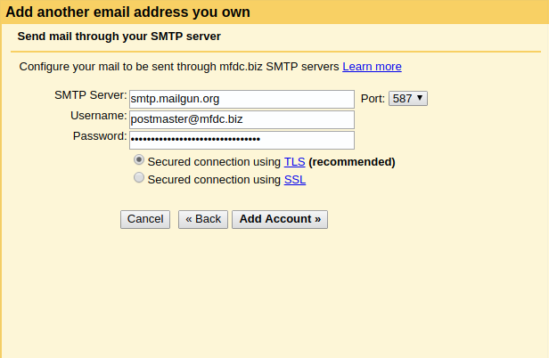

GMail
=====
At MFDC we encourage the use of your usual email service to receive email - we do not usually store email ourselves.

This guide is a walkthrough to setup your MFDC email with Gmail.

Your **incoming** email should already have been set up by one of the team. This means any email addressed to `your-first-name@mfdc.biz` should end up wherever you usually receive email.


Outgoing email setup
--------------------
To send **outgoing** email you need to complete the following steps:


* Login to [Gmail](http://mail.google.com)


* Click the cog button in the top right then click `Settings`


* Select the `Accounts and Import` tab


* Under 'Send mail as' click 'Add another email address that you own'


* Complete your name and enter your email address (usually `your-first-name@mfdc.biz`)


* Note: You may uncheck “Treat as an alias” if you wish, for more info see this [link](https://support.google.com/mail/bin/answer.py?ctx=gmail&answer=1710338&hl=en&authuser=0)


* Enter the following details (these details are the same for everyone with no alterations):

```
SMTP Server: smtp.mailgun.org
Port: 587
Username: postmaster@mfdc.biz (NOTE: THIS IS NOT YOUR EMAIL ADDRESS!)
Password: **Someone should tell you this**
Secured connection, using TLS: Checked
```




* Click `Add account`


* Close the window. You do not need to enter a verification code.


* You will shortly receive an email address from Gmail asking you to confirm. Click the link in that email to finish the process.

* **(Optional)** Under the `Accounts and Import` screen set the outgoing email address to default if you prefer

* Send an email to [Matt](mailto:matt@mfdc.biz) with your newly setup email to confirm


**[Back to Table of Contents](../README.md)**
